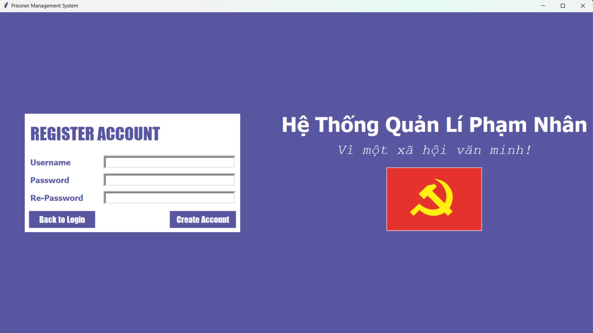
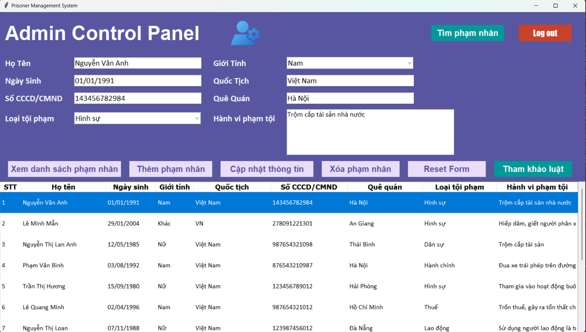
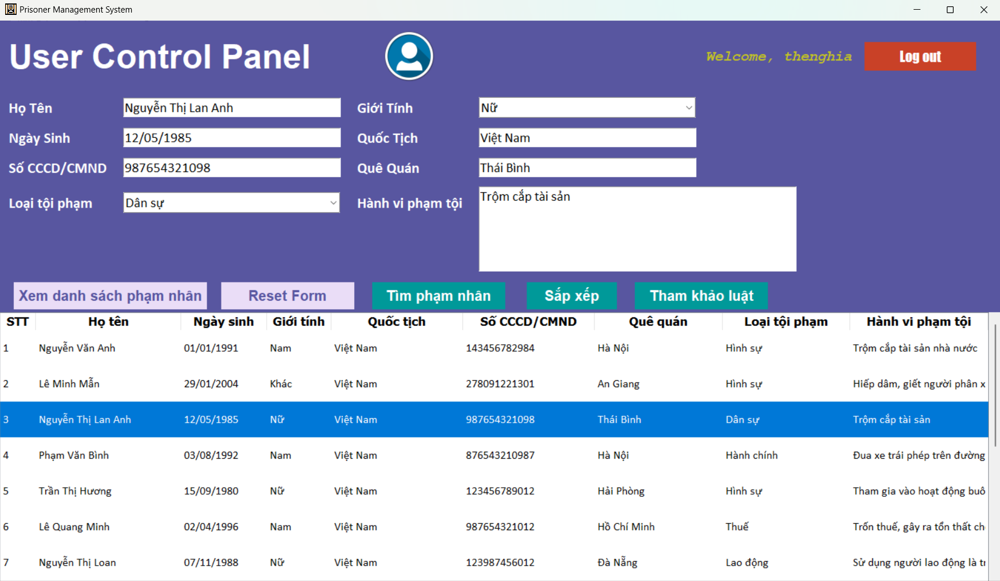
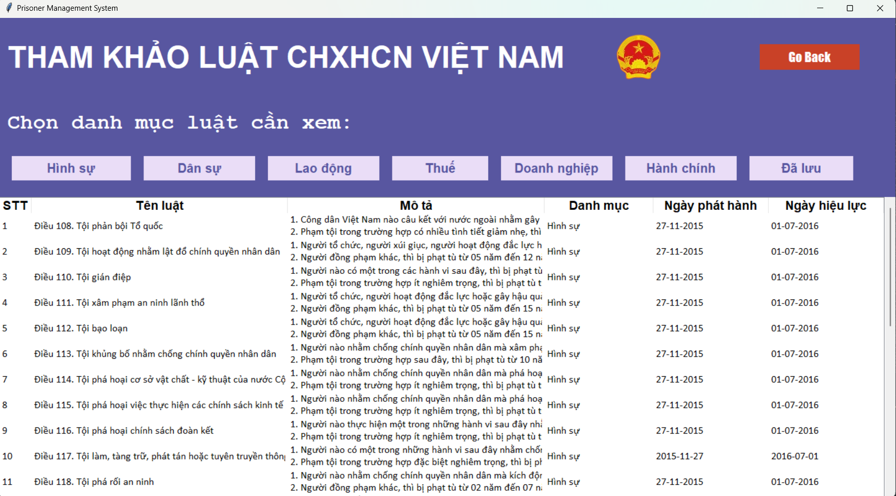

# ĐỒ ÁN KẾT THÚC MÔN LẬP TRÌNH PYTHON
- Đề tài: Hệ thống quản lí phạm nhân
- GVHD: Đinh Nguyễn Trọng Nghĩa
- Thành viên nhóm:
1. Đặng Thế Nghĩa - 2001223025
2. Phạm Nguyễn Ngọc Cường - 2001220471

## Công nghệ sử dụng (Tech stack)
1. Tkinter - Python
2. API: ExpressJS & MongoDB
3. Deploy Restful API: Vercel

## Chức năng (Functionality)
1. Phân quyền: Admin và User
2. Đăng nhập, đăng kí , đăng xuất tài khoản
3. CRUD: Xem danh sách, thêm, sửa, xóa thông tin phạm nhân
4. API: Hiển thị thông tin danh mục Luật, bộ luật hiện hành tại Việt Nam, 
thông tin chi tiết từng luật từ API, lưu luật vào file json
5. Tìm kiếm thông tin phạm nhân bằng Số CCCD/CMND

## Đặc tả các trang chính (Pages)
#### 1. Login page

#### 2. Register page

#### 3. Admin page

#### 4. User page

#### 5. Laws page

## Tham khảo (References)
1. [Docs offical Tkinter](https://docs.python.org/3/library/tkinter.html)
2. [Docs offical ExpressJS](https://expressjs.com/)
3. [Docs offical MongoDB](https://github.com/mongodb/docs)
4. [Docs offical Vercel](https://vercel.com/docs/deployments/overview)