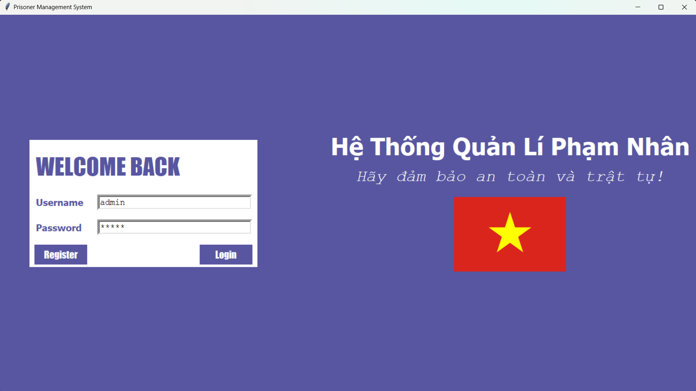
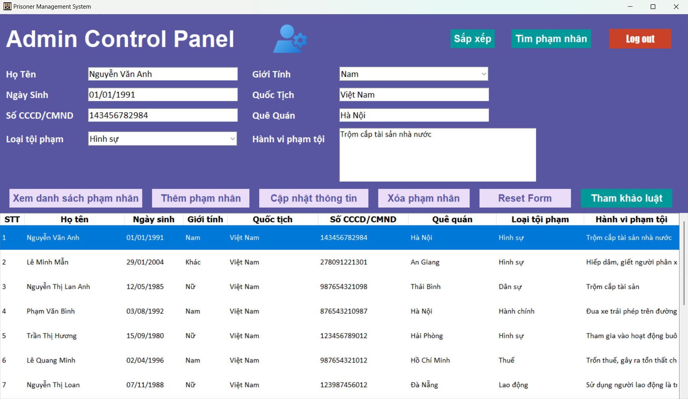

# ĐỒ ÁN KẾT THÚC MÔN LẬP TRÌNH PYTHON
- Đề tài: Hệ thống quản lí phạm nhân

## Công nghệ sử dụng (Tech stack)
1. Tkinter - Python
2. API: ExpressJS & MongoDB
3. Deploy Restful API: Vercel

## Chức năng (Functionality)
1. Phân quyền: Admin và User
2. Đăng nhập, đăng kí, đăng xuất tài khoản
3. CRUD: Xem danh sách, thêm, sửa, xóa thông tin phạm nhân
4. API: Hiển thị thông tin danh mục Luật, bộ luật hiện hành tại Việt Nam, 
thông tin chi tiết từng luật từ API, lưu luật vào file json
5. Tìm kiếm thông tin phạm nhân bằng Số CCCD/CMND
6. Sắp xếp danh sách phạm nhân theo họ tên hoặc ngày sinh
7. Đóng gói ứng dụng thành từ file .py => file .exe (Folder Prisoner_manage_system_App)

## Đặc tả các trang chính (Pages)
### 1. Login page

### 2. Register page

### 3. Admin page

### 4. User page

### 5. Laws page

## Hướng dẫn sử dụng (Usage App)
* Có 2 cách: 
1. Mở trực tiếp chương trình trong file main.py
- Yêu cầu: Máy tính có cài python, tkinter.
2. Mở thư mục Prisoner_manage_system_App, tìm file main.exe và run

## Tham khảo (References)
1. [Docs official Tkinter](https://docs.python.org/3/library/tkinter.html)
2. [Docs official ExpressJS](https://expressjs.com/)
3. [Docs official MongoDB](https://github.com/mongodb/docs)
4. [Docs official Vercel](https://vercel.com/docs/deployments/overview)